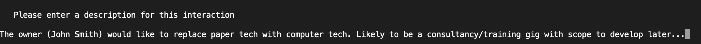
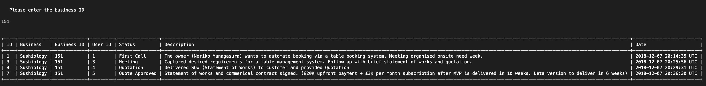

CLI CRM Application
-------------------

Description
----------

CRM app is a Customer Relations Management tool.
CRM app can store business contact details retrieved from Yelp's Fusion API and log all customer interactions.

Features
-------------------
- Support for multliple user logins
- Find new customers via Yelp's local-search service
- Log and track all interactions with businesses
- Search customer interaction history by business, user or date

MVP
------------------
- Store business data retrieved from Yelp Fusion API in a local database
- Create a new record
- Update record status and description
- Delete record 
- View all business contacts

Stretch Goals Acheieved
------------------
- Filter records by business, user and contact date 

Suggested improvement
------------------
- Fully utilise Yelp Fusion API search options
- Selective record store for Yelp data retrieval to avoid duplicate data
- Improved data entry validation
- Add login password protection
- Refactor existing code
- Improve UI (Menu nativation, styling and window refresh)
- Add a KPI analytics module for managers

Install instructions
-------------------

1. Fork and clone this lab.
2. Move into the cloned directory in terminal and run 'bundle install'.
3. Run 'ruby bin/run.rb' to run the application.
4. Create a user account by entering a username of choice when prompted.

Operation instructions
-------------------

1. Enter username

2a. Login will check if user already exists or create a new account
  
  

2b. Login will check if user already exists or create a new account

  

3a. Select '1' on the options menu to 'Search Businesses by catagory and location'
  
3b. To search enter a catagory and location seperated by a comma.
   The search results are limited to 10 at a time via an application preference.
   The search results are automatically saved to the local application database.

  
  
4. Select '2' view 'contact history'.

  

  

  

  

  

  

  

  

  

  

  

  
  
  
  
  
  
  
  
  
  
  
  
  
  
  
  
  
  
  
  

